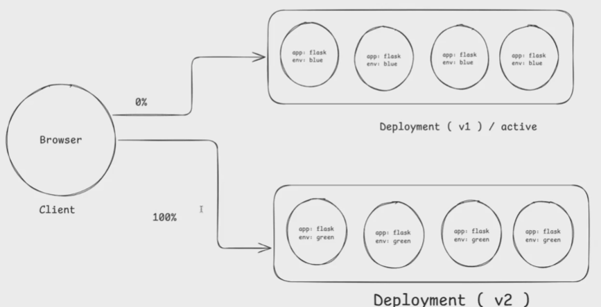
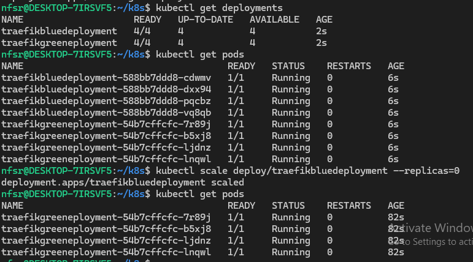

# K8S Blue/Green Strategy

## Overview
In a Blue-Green Deployment, we maintain two environments (Blue and Green) to ensure zero downtime when deploying new versions of an application. At any given time:

The Blue environment is the currently active version of the application.

The Green environment is the new version that will be switched to once it's fully tested.

In this example, we have two deployments for Traefik: one for the Blue environment and one for the Green environment. The blue deployment has been scaled down after testing, leaving green as the active environment.

### ✅ Benefits:
Zero downtime

Instant rollback if something goes wrong

### 🔁  Switching Between Blue and Green
The main idea behind the Blue-Green deployment strategy is to swap the traffic between Blue and Green environments when you're ready to go live with the new version.

Here’s how you can manage it:

Test Green Deployment: Ensure the Green environment (new version) is running correctly and has been thoroughly tested.

Switch Traffic: Once you're ready to switch from `Blue` to `Green` using `kubectl scale deploy/traefikbluedeployment --replicas=0` command

